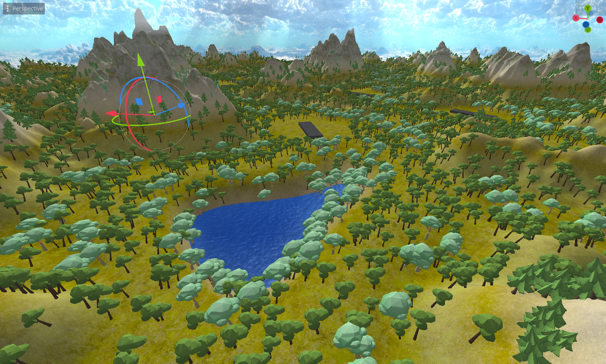

## Comprehensive System Package for Effortless, Customizable, and Visually Appealing Procedural Terrain Generation

Designed with my [flight sim](https://github.com/FilipRuman/Flight-sim) project in mind.

### Key Features:

-   **Ground Texture Shader:** Includes a custom shader and script for easy customization. Blends textures at specified heights using triplanar mapping techniques.
-   **Object Spawning:** A specialized script that enables the instantiation of objects, such as trees, at specified heights. Features a function to visualize spawn levels on the terrain material for simplified customization.
-   **Infinite Terrain Generation:** Implements a system for seamless, infinite terrain loading. New terrain tiles are loaded across multiple frames to prevent performance spikes.
-   **Large Structure Placement:** Facilitates the procedural spawning of large structures. Samples terrain height and intelligently places structures on flat areas to ensure proper alignment with the terrain.
-   **Water Implementation:** Includes a water system that can be placed at a defined height. Features procedural graphics through a custom water shader.
-   **Advanced Noise Management:** Supports the sampling of multiple noise levels with varying strengths and frequencies. Uses curves for easy configuration, allowing assignment of smoothness maps to flatten lower terrain and roughen hills. Enables increased noise strength at specified heights.
